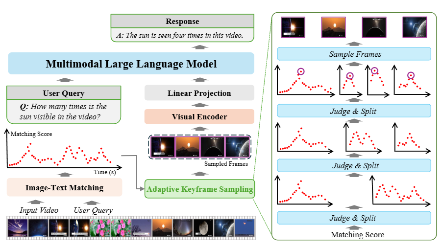

# Adaptive Keyframe Sampling for Long Video Understanding 
This is the official implementaion of paper '[***Adaptive Keyframe Sampling for Long Video Understanding***](https://arxiv.org/abs/2502.21271)', which is accepted in ***CVPR 2025***.


## Abstract

Multimodal large language models (MLLMs) have enabled open-world visual understanding by injecting visual input as extra tokens into large language models (LLMs) as contexts. However, when the visual input changes from a single image to a long video, the above paradigm encounters difficulty because the vast amount of video tokens has significantly exceeded the maximal capacity of MLLMs. Therefore, existing video-based MLLMs are mostly established upon sampling a small portion of tokens from input data, which can cause key information to be lost and thus produce incorrect answers.
This paper presents a simple yet effective algorithm named AKS. It inserts a plug-and-play module known as keyframe selection, which aims to maximize the useful information with a fixed number of video tokens. We formulate keyframe selection as an optimization involving (1) the relevance between the keyframes and the prompt, and (2) the coverage of the keyframes over the video, and present an adaptive algorithm to approximate the best solution. Experiments on two long video understanding benchmarks validate that AKS improves video QA accuracy (beyond strong baselines) upon selecting informative keyframes. Our study reveals the importance of information pre-filtering in video-based MLLMs. Our code and models will be open-sourced.

## Overview

<p align="center">
    </a> <br>
    The overall framework of our approach.
</p>

## Dataset Downloading

LongVideoBench can be downloaded from [Hugging Face](https://huggingface.co/datasets/longvideobench/LongVideoBench/tree/main).
VideoMME can be downloaded from [Hugging Face](https://huggingface.co/datasets/lmms-lab/Video-MME/tree/main).


## Dataset Processing
For LongVideoBench, the lvb_val.json can be directly used.
For VideoMME, we provide a label [file](./datasets/videomme.json) which is modified from the raw test-00000-of-00001.parquet file of VideoMME.

## Feature Extraction
We use the BLIP/CLIP/SeViLA to extract the frame feature. You can follow the instruction of [SeViLA](https://github.com/Yui010206/SeViLA) to install the enviroment.

```Shell
conda create -n SeViLA python=3.9
conda activate SeViLA
git clone https://github.com/Yui010206/SeViLA.git
cd SeViLA
pip install -e .
pip install numpy==1.24.4
pip install spacy
```
Then please use the [sevila.py](./sevila.py) to replace the raw SeViLA/lavis/models/sevila_models/sevila.py. 
```Shell
python feature_extract.py --dataset_name longvideobench --dataset_path ./datasets/longvideobench --extract_feature_model blip
```

Because the decord function is slow to read the video, it is recommended to split this process into multiple parallel processes.
Since the process of  extracting feature takes a lot time, it is recommended to directly using our results in [outscores](./outscores/).


To reuse video feature, it's better to save the video features (SeViLA not supported) rather than store the score directly. To achieve, please use [blip_image_text_matching.py](./blip_image_text_matching.py) to replace the raw SeViLA/lavis/models/blip_models/blip_image_text_matching.py.
```Shell
python feature_extract_store.py --dataset_name longvideobench --dataset_path ./datasets/longvideobench --extract_feature_model blip
```
## Frame Selection
After extracting the video feature, we use [frame_selcet.py](./feature_extract.py) to adaptively select video frames as LLM inputs. We also provide the selected scores in [outscores](./outscores).

```Shell
python frame_select.py
```

## Evaluation
We use LLaVA-Video-7B-Qwen2 as our baseline, which can be downloaded from [Hugging Face](https://huggingface.co/lmms-lab/LLaVA-Video-7B-Qwen2/tree/main). And you can put the checkpoints under this [path](./checkpoints/llava_video_7b/). 

If you encouter "size mismatch for vision_model.embeddings.patch_embedding.weight", you can refer to this [issue](https://github.com/LLaVA-VL/LLaVA-NeXT/issues/246#issuecomment-2362829804) to solve it.

Please make sure that the folder name of the checkpoints is "LLaVA-NeXT-Video-7B-Qwen2", otherwise it may load the model incorrectly. Special thanks to [@JonnesLin](https://github.com/JonnesLin) for his comments.

We use [lmms_eval](https://github.com/EvolvingLMMs-Lab/lmms-eval) library to evaluate performance. You can follow their instruction to install the evaluation enviroment.

```Shell
conda create -n AKS python=3.9
conda activate AKS
git clone https://github.com/LLaVA-VL/LLaVA-NeXT
cd LLaVA-NeXT
pip install -e ".[train]"
cd ..
git clone https://github.com/EvolvingLMMs-Lab/lmms-eval
cd lmms-eval
pip install -e .
```

To allow adaptive sampling video input, please use [llava_vid.py](./evaluation/llava_vid.py) to replace the raw lmms_eval/models/llava_vid.py, use [task.py](./evaluation/task.py) to replace the raw lmms_eval/api/task.py, and use [evaluator.py](./evaluation/evaluator.py) to replace the raw lmms_eval/evaluator.py

For LongVideoBench，please replace the raw longvideobench_val_v.yaml, longvideobench_val_i.yaml and [utils.py](https://github.com/EvolvingLMMs-Lab/lmms-eval/blob/main/lmms_eval/tasks/longvideobench/utils.py) in lmms_eval/tasks/longvideobench/ with [longvideobench_val_v.yaml](./datasets/longvideobench/longvideobench_val_v.yaml), [longvideobench_val_i.yaml](./datasets/longvideobench/longvideobench_val_i.yaml) and [utils.py](./datasets/longvideobench/utils.py)

For VideoMME，please delete the [README.md](https://huggingface.co/datasets/lmms-lab/Video-MME/blob/main/README.md), and replace the raw videomme.yaml and [utils.py](https://github.com/EvolvingLMMs-Lab/lmms-eval/blob/main/lmms_eval/tasks/videomme/utils.py) in lmms_eval/tasks/videomme/ with [videomme.yaml](./datasets/videomme/videomme.yaml) and [utils.py](./datasets/videomme/utils.py). 

Then you can run the following files to get the results. 

```Shell
bash ./evaluation/scripts/llava_video_7b/longvideobench_aks_llava_video_7b.sh
bash ./evaluation/scripts/llava_video_7b/longvideobench_uni_llava_video_7b.sh
bash ./evaluation/scripts/llava_video_7b/videomme_aks_llava_video_7b.sh
bash ./evaluation/scripts/llava_video_7b/videomme_uni_llava_video_7b.sh
```

For evaluating with LLaVA OneVision, please download the checkpoint from [HuggingFace](https://huggingface.co/lmms-lab/llava-onevision-qwen2-7b-ov), replace the raw lmms_eval/models/llava_onevision.py with [llavaone_vision.py](./evaluation/llava_onevision.py), and replace the raw LLaVA-NeXT/llava/mm_utils.py with [mm_utils.py](./evaluation/mm_utils.py).

For evaluating with Qwen2-VL-7B-Instruct, please download the checkpoint from [HuggingFace](https://huggingface.co/Qwen/Qwen2-VL-7B-Instruct), replace the raw lmms_eval/models/qwen2_vl.py with [qwen2_vl.py](./evaluation/qwen2_vl.py), and put [qwen2_load_video.py](./evaluation/qwen2_load_video.py) lmms_eval/lmms_eval/models/model_utils. Also, please do the following configuration in the environment.

```Shell
pip install qwen-vl-utils
pip install flash-attn --no-build-isolation
```

If you're having trouble installing flash-attn, you can download the xhl file from [Github](https://github.com/Dao-AILab/flash-attention/releases) to install it according to your environment information. On our server we used the following version for installation.

```Shell
pip install flash_attn-2.7.3+cu11torch2.1cxx11abiFALSE-cp39-cp39-linux_x86_64.whl --no-build-isolation
```

## Acknowledgement

This project is based on BLIP ([paper](https://arxiv.org/pdf/2201.12086), [code](https://github.com/salesforce/LAVIS)), SeViLA ([paper](https://arxiv.org/pdf/2305.06988), [code](https://github.com/Yui010206/SeViLA)),  LLaVA-NeXT ([paper](https://arxiv.org/abs/2410.02713), [code](https://github.com/LLaVA-VL/LLaVA-NeXT)), lmms_eval([paper](https://arxiv.org/abs/2407.12772), [code](https://github.com/EvolvingLMMs-Lab/lmms-eval)), thanks for their excellent works.

## Citation
If you find AKS useful for your research and applications, please consider giving us a star ⭐ and citing it by the following BibTeX entry:
```
@article{tang2025adaptive,
  title={Adaptive Keyframe Sampling for Long Video Understanding},
  author={Tang, Xi and Qiu, Jihao and Xie, Lingxi and Tian, Yunjie and Jiao, Jianbin and Ye, Qixiang},
  journal={arXiv preprint arXiv:2502.21271},
  year={2025}
}
```
